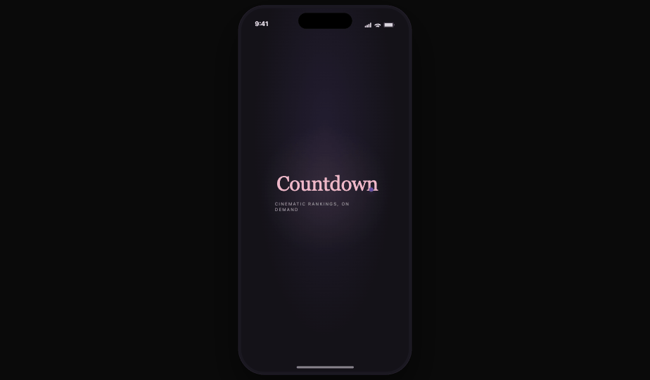
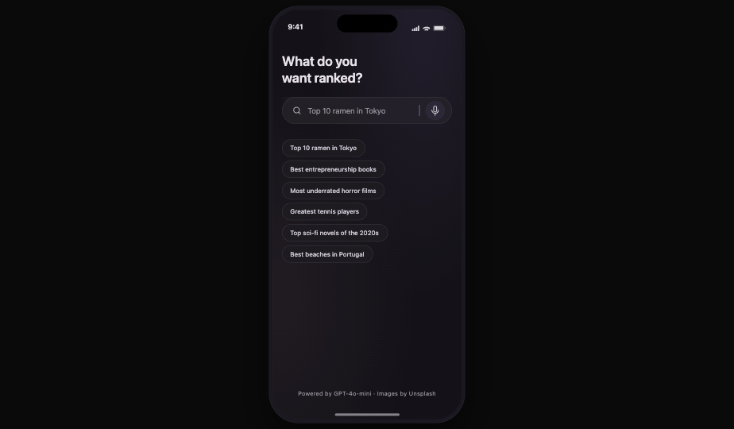
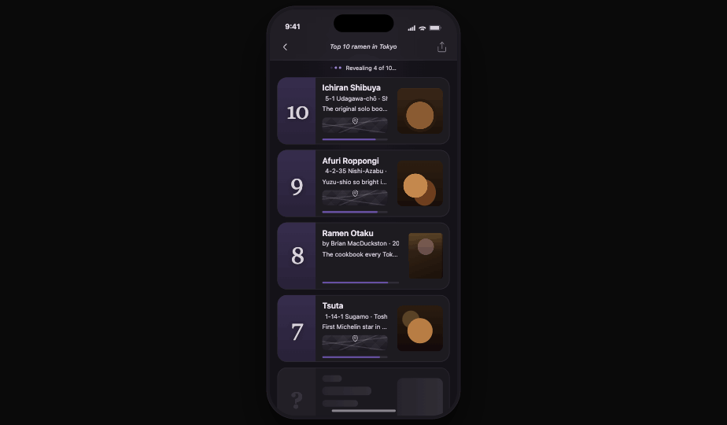
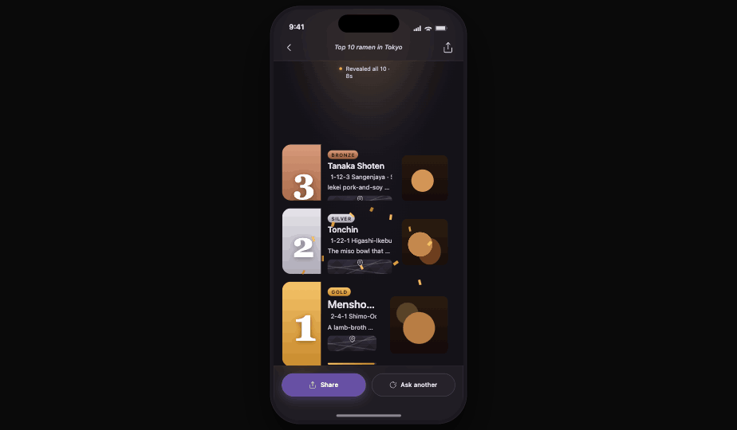
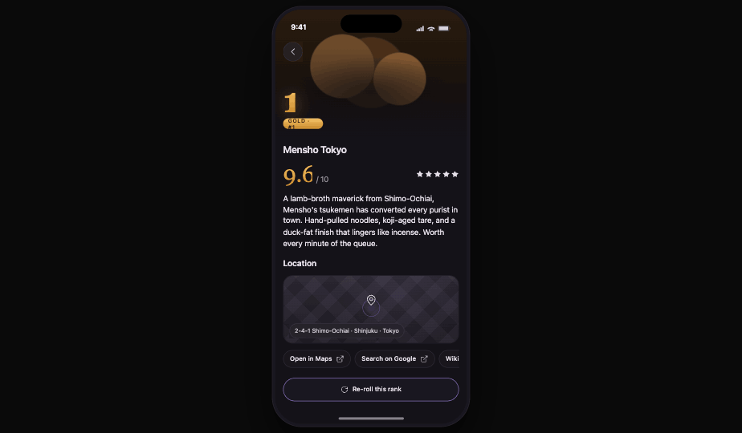
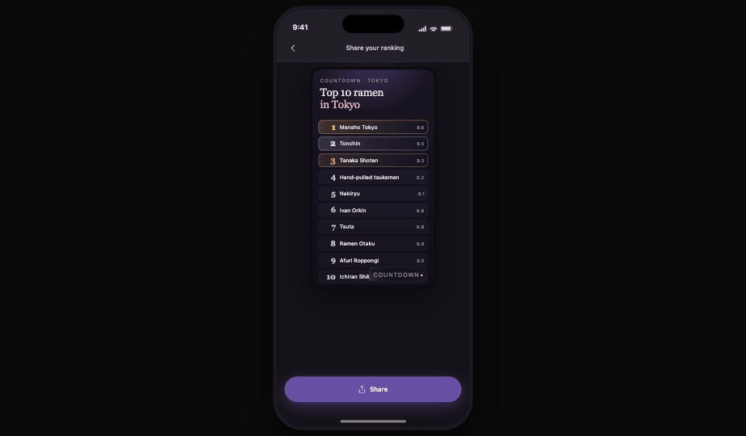
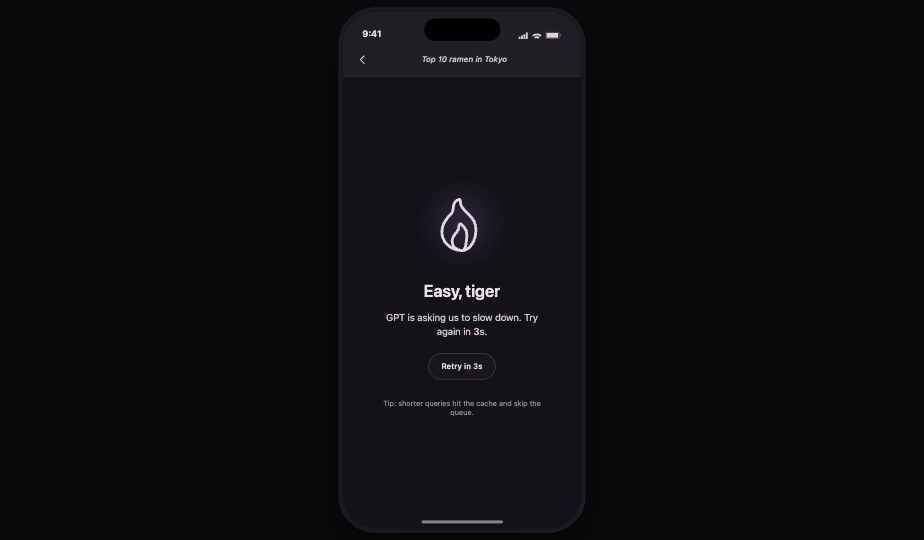

# Countdown — Flutter Ranking App (Full Spec v2)

A Flutter app that turns any "give me the top N…" question into a **cinematic streaming countdown reveal**, with rich, adaptive cards and shareable output. Built around a refined deep-purple identity anchored on **#6750A4**.

---

## 1. The concept

User types or speaks a ranking question → app streams the answer back as a top-N list, revealing items **#N down to #1** with animation, building tension. Each item is a rich, adaptive card with image, score, "why," and type-specific extras (map pin, author, portrait, etc.).

**One-line pitch:** "Ask anything rankable. Watch it count down."

**Why it wins the brief:**
- Demo-friendly: a 30-second screen recording feels cinematic, not utilitarian.
- Hits every visual cue Labhouse mentions (images, stars, locations, scores) in one coherent UI.
- Uses modern AI patterns (streaming + structured outputs) — signals technical depth.
- Tight scope: one main screen + detail + share. Defendable in 8h.

---

## 2. Visual identity & theme

**Seed color:** `#6750A4` (Material 3 baseline purple) — but treated like a *brand* color rather than a default. Generated palette via M3 `ColorScheme.fromSeed`, then overridden with custom neutrals to feel premium and editorial, not stock-Material.

### 2.1 Color tokens

**Dark theme (primary mode for demo):**

| Token | Value | Use |
|---|---|---|
| `brand.primary` | `#6750A4` | Brand accents, focus rings, tab indicator |
| `brand.primaryContainer` | `#4F378B` | Filled buttons, primary chip backgrounds |
| `brand.onPrimary` | `#FFFFFF` | Text on primary |
| `brand.secondary` | `#9A82DB` | Hover/pressed states, secondary accents |
| `brand.tertiary` | `#EFB8C8` | Subtle pink accent for highlights & "ask" CTA |
| `surface.base` | `#141218` | App background (near-black, slight violet tint) |
| `surface.elevated` | `#1D1B20` | Cards |
| `surface.glass` | `#26232A` @ 70% + 24px backdrop blur | Floating panels, sticky search |
| `surface.outline` | `#49454F` | Subtle dividers, card borders |
| `text.primary` | `#E6E0E9` | Body |
| `text.secondary` | `#CAC4D0` | Captions, supporting |
| `text.tertiary` | `#938F99` | Disabled, hints |
| `state.error` | `#F2B8B5` | Error text |
| `state.success` | `#A5E8B6` | Subtle success ticks |

**Light theme** (provided but not the demo focus): M3 light derived from the same seed, with cards on `#FFFBFE` and primary text `#1C1B1F`.

### 2.2 Rank-tier accents

The three top ranks earn distinct treatments. The colors are tuned to harmonize with #6750A4 rather than clash:

| Rank | Gradient | Glow | Use |
|---|---|---|---|
| 1 — Gold | `#F5C46A → #C9892A` | warm amber, 24px blur | Border ring + tier badge + confetti tint |
| 2 — Silver | `#E5E4EA → #A6A4B0` | cool white, 20px blur | Border ring + tier badge |
| 3 — Bronze | `#D89B7B → #9B5A3B` | warm copper, 16px blur | Border ring + tier badge |
| 4-N | none | none | Plain purple-tinted outline only |

The badge sits at the top-left of the card and contains a numeral in display serif.

### 2.3 Typography

Two-font system, both free on Google Fonts:

- **Display:** `Fraunces` (variable serif) — used for the giant rank numerals (`72sp` on top-3 cards, `48sp` on others) and the splash logo wordmark. Gives an editorial, magazine feel.
- **Body / UI:** `Inter` (variable sans) — titles, body, captions, all UI.

Scale (semantic):

| Token | Size / weight | Use |
|---|---|---|
| `display.l` | Fraunces 72 / 600 | Top-3 rank numerals |
| `display.m` | Fraunces 48 / 500 | Rank 4-N numerals, share card titles |
| `headline.l` | Inter 28 / 600 | Search screen prompt |
| `title.l` | Inter 20 / 600 | Card titles |
| `title.m` | Inter 17 / 600 | Detail headings |
| `body.l` | Inter 16 / 400 | Body text |
| `body.m` | Inter 14 / 400 | "Why it ranks" copy |
| `label.l` | Inter 13 / 500 | Buttons, badges |
| `caption` | Inter 12 / 400 / `text.secondary` | Metadata |

### 2.4 Spacing, radius, elevation

- **Spacing scale:** 4, 8, 12, 16, 20, 24, 32, 48 (no arbitrary values).
- **Radius:** cards `20`, badges `999` (pill), buttons `16`, inputs `28` (large rounded search bar), images inside cards `12`.
- **Elevation:** never use shadow alone — pair with subtle 1px outline at `surface.outline @ 50%` to read on dark surfaces. Glass surfaces add 24px backdrop blur.
- **Frosted glass treatment:** sticky search bar and the share-export overlay use `BackdropFilter` + a 70%-opacity surface — gives an iOS 26 / Material Expressive feel without overdoing it.

### 2.5 Motion tokens

| Token | Duration | Curve | Use |
|---|---|---|---|
| `motion.fast` | 150ms | `easeOutCubic` | Button presses, micro-feedback |
| `motion.standard` | 280ms | `easeOutCubic` | Card reveals, screen elements |
| `motion.emphasized` | 450ms | `Cubic(0.05, 0.7, 0.1, 1.0)` | Hero transitions, page changes |
| `motion.dramatic` | 700ms | `easeOutQuart` | #1 reveal pulse, confetti |
| `motion.stagger` | 60ms | linear | Inter-card stagger |

### 2.6 Iconography

- **Lucide icons via `lucide_icons`** (consistent 1.5px stroke, refined look — beats Material default).
- 24px default; 20px in compact rows; 16px in chips.
- Icons inherit `text.secondary` unless interactive (then `brand.secondary`).

---

## 3. Screen-by-screen UI

### 3.1 Splash / cold start



- Full-screen `surface.base`.
- Centered Fraunces logo wordmark "Countdown" with a single purple dot after the "n" pulsing at 1.2s loop.
- Auto-routes to Search after 400ms (or whenever first frame is ready — whichever comes later).

### 3.2 Search screen



- Layout: top safe-area padding, large headline "**What do you want ranked?**" in `headline.l`.
- Below it: a large rounded glass input (radius 28, height 56, frosted), with:
  - left-aligned `Search` icon
  - placeholder rotates every 3s through 6 example queries with a smooth top-out / bottom-in animation
  - right-aligned mic icon (stretch feature; fades out gracefully if speech permission denied)
- Below the input: 6 example query chips in two rows, tappable to autofill (curated mix: "Top 10 ramen in Tokyo", "Best entrepreneurship books", "Most underrated horror films", "Greatest tennis players of all time", "Top sci-fi novels of the 2020s", "Best beaches in Portugal").
- Bottom: small footer "Powered by GPT-4o-mini · Images by Unsplash."
- Submitting (enter key or send button) triggers a **shared axis transition** to the Ranking screen.

### 3.3 Ranking (countdown) screen — the centerpiece

**Streaming state:**


**#1 reveal moment:**


- **App bar:** glass-frosted, sticky. Left: back chevron. Center: shortened query in `label.l`, italicized. Right: share icon (enabled once `done`).
- **Hero area:** sub-header showing live status:
  - On `loading`: thin progress indicator + "Asking GPT…" caption.
  - On `streaming`: animated dots + "Revealing 4 of 10…" caption.
  - On `done`: a subtle "Tap any rank for details" hint (auto-dismisses after 4s).
- **Card list:** vertical `ListView.builder` with 10 slots, each ~140dp tall.
  - Slots start as **skeletons** (shimmer over rounded rectangles) the instant the user submits.
  - Cards animate in **#10 → #1** as items arrive.
- **Card anatomy:**
  - Background: `surface.elevated` with a 1px outline. Top-3 swap the outline for the tier gradient ring (2px wide) and add a soft outer glow.
  - Left strip (80dp wide): the rank numeral in Fraunces (`display.l` for top-3, `display.m` otherwise). Behind the numeral is a vertical gradient bar of the tier color (top-3) or `brand.primary @ 30%` (others).
  - Right area: image (96×96 rounded 12) on the right; title + author/tagline/address + score bar on the left of the image.
  - Tier badge (gold/silver/bronze) sits as a small pill above the title on top-3 only.
  - Score bar: 4px tall, animated fill from 0 to actual score with `motion.standard`, colored by tier (or `brand.primary`).
  - "Why it ranks": one-line truncated description in `body.m / text.secondary`, fades to gradient at the end if truncated.
- **Per-card variant detail:**
  - **PlaceCard:** below the title row, an embedded 56dp-tall map strip (OpenStreetMap tile) with a single purple pin. Tap → detail with full map.
  - **BookCard:** image is the book cover (3:4 ratio override); below title shows "by {author} · {year}" + stars.
  - **PersonCard:** image is circular (avatar style); tagline in italic.
  - **GenericCard:** square image, no extras.
- **Reveal animation per card:**
  - Begins at opacity 0, scale 0.95, blur 8px.
  - Animates to opacity 1, scale 1.0, blur 0 over `motion.standard` (280ms).
  - 60ms stagger if multiple arrive in burst.
  - Light haptic (`HapticFeedback.lightImpact`) on entry; medium on #1.
  - Score bar fills 200ms after the card lands.
- **#1 treatment:**
  - Card reveal uses `motion.dramatic` (700ms).
  - On land, a brief gold confetti burst (8 particles, 1.2s lifecycle) overlays from behind the card.
  - The whole screen background subtly warms (a 6% gold overlay fades in for 800ms then back out).
  - Medium haptic.
- **Footer:** when `done`, a sticky bottom glass bar with two pill buttons: "Share" and "Ask another."

### 3.4 Detail screen



- Hero transition: the card's image scales up to a 320dp hero header at the top.
- Below: rank numeral + tier badge, title (`title.l`), full "why it ranks" copy (no truncation), full map (for `place`), external link chips ("Open in Maps", "Search on Google", "Wikipedia" — when applicable).
- Bottom CTA: "Re-roll this rank" (stretch feature, animates a new item in its place).

### 3.5 Share screen



- Composes a 9:16 image: header with query, all 10 cards stacked at small scale, "Countdown" wordmark watermark at the bottom-right with a subtle purple gradient.
- Preview is rendered to a `RepaintBoundary` then captured via the `screenshot` package and handed to `share_plus`.
- Light haptic on capture.

### 3.6 Caching (invisible to the user)
- No history UI. Past rankings are persisted to `hive_ce` purely as a query → result cache.
- The `RankingRepository` consults the cache first; on a hit, it skips OpenAI entirely and streams the cached items back through the same `Stream<RankItem>` interface (small delays preserved so the reveal animation still feels alive).
- Cache key: normalized query string (lowercased, whitespace-collapsed). Cache size: LRU, max 50 entries. No TTL.
- Net effect: re-typing or re-tapping a recent query (including the example chips on Search) loads instantly and saves an API call. The user never sees a "history" or "saved searches" surface.

### 3.7 Empty / error / offline states



- **Network error:** illustrated empty state (a single line drawing of a satellite in `brand.secondary`), title "Lost signal," body "Couldn't reach the server. Try again?" + retry button.
- **Rate limited (429):** "Easy, tiger" with a small purple flame icon + countdown timer to retry.
- **Bad key (401):** "Missing key" with instructions to set `--dart-define=OPENAI_API_KEY`.
- **Malformed response:** "GPT gave us gibberish. Want to try again?" + retry.
- **Offline banner:** slim non-blocking top banner appearing only when offline, glass-frosted.

---

## 4. Stack

| Layer | Choice | Reason |
|---|---|---|
| Language | Dart 3.5+ | Sealed classes, patterns, sound null safety |
| State | `flutter_riverpod` ^3.3.1 (manual providers) | Async-native, stream-friendly. Codegen (`riverpod_generator` / `riverpod_lint` / `custom_lint`) was evaluated but dropped — its analyzer pin (7-9) conflicts with `json_serializable ^6.14` (analyzer 10+). Manual providers cost ~5 lines per provider; we keep the modern stack everywhere else. |
| Models | `freezed` 3.x + `json_serializable` | Sealed unions, immutability |
| **AI client** | **`openai_dart` 5.x** — streaming + `response_format: json_schema` against `gpt-4o-mini` | OpenAPI-generated, actively maintained, eliminates ~150 lines of custom SSE/retry/schema code |
| HTTP (non-AI) | `dio` ^5.9.2 + `dio_smart_retry` ^7.0.1 + `pretty_dio_logger` ^1.4.0 | Unsplash + retry/logging |
| Image enrichment | Unsplash API (free) | No billing setup |
| Maps | `flutter_map` + OpenStreetMap | No Google Maps key |
| Local storage | **`hive_ce` ^2.19.3** + `hive_ce_flutter` ^2.3.4 + `path_provider` ^2.1.4 | Active community edition; original `hive` unmaintained since 2022. Used as invisible query cache (no UI). |
| Voice (stretch) | `speech_to_text` | iOS/Android ASR |
| Animations | `flutter_animate` + Hero + custom + **`confetti`** | Declarative + the #1 burst |
| Images | `cached_network_image` | Disk + memory cache |
| Connectivity | `connectivity_plus` | Offline banner |
| Logs | `talker_flutter` | Shake-to-open overlay |
| Share | `screenshot` + `share_plus` | Capture widget tree + share sheet |
| Fonts | `google_fonts` (Fraunces + Inter) | Editorial + UI pairing |
| Icons | **`lucide_icons_flutter`** | Active fork; original `lucide_icons` last shipped Jun 2023 |
| Secrets | `--dart-define=OPENAI_API_KEY=...` | Brief requires a constant + comment marker; this maps 1:1 |
| Linting | **`very_good_analysis`** | Stricter than `flutter_lints`; signals discipline |
| Testing | `flutter_test`, `mocktail`, **`alchemist`** (goldens) | Alchemist handles platform-font drift that breaks `golden_toolkit` on CI |

---

## 5. Architecture

Feature-first, three-layer Clean Architecture.

```
lib/
├── main.dart
├── app.dart                                # MaterialApp.router, theme, routing
│
├── core/
│   ├── env.dart                            # reads OPENAI_API_KEY, fails fast
│   ├── result.dart                         # sealed Result<T, AppError>
│   ├── errors.dart                         # AppError union
│   ├── http/
│   │   └── dio_provider.dart               # interceptors (smart retry + pretty logger) — non-AI HTTP only
│   ├── theme/
│   │   ├── app_theme.dart                  # ThemeData for light + dark
│   │   ├── color_tokens.dart               # the table in §2.1
│   │   ├── tier_styles.dart                # gradients, glows, badges
│   │   ├── typography.dart                 # Fraunces + Inter text styles
│   │   ├── spacing.dart                    # 4/8/12/16/20/24/32/48 constants
│   │   ├── radii.dart                      # radius constants
│   │   └── motion.dart                     # durations + curves
│   ├── logger.dart                         # talker
│   └── widgets/
│       ├── glass_surface.dart              # BackdropFilter wrapper
│       ├── skeleton.dart                   # shimmer
│       ├── error_panel.dart
│       └── empty_state.dart
│
├── features/
│   ├── ranking/
│   │   ├── data/
│   │   │   ├── ranking_client.dart         # interface (testability seam)
│   │   │   ├── openai_client.dart          # thin wrapper over openai_dart; emits Stream<RankItem>
│   │   │   ├── ranking_cache.dart          # hive_ce-backed, LRU max 50, no TTL
│   │   │   ├── ranking_repository.dart     # cache-first, then OpenAI fallback
│   │   │   └── prompt_builder.dart
│   │   ├── domain/
│   │   │   ├── rank_item.dart              # sealed: Place|Book|Person|Generic
│   │   │   ├── ranking.dart
│   │   │   └── ranking_state.dart          # union: idle|loading|streaming|done|error
│   │   └── presentation/
│   │       ├── ranking_controller.dart     # AsyncNotifier
│   │       ├── ranking_screen.dart
│   │       └── widgets/
│   │           ├── reveal_card.dart        # dispatches per kind
│   │           ├── place_card.dart
│   │           ├── book_card.dart
│   │           ├── person_card.dart
│   │           ├── generic_card.dart
│   │           ├── score_bar.dart
│   │           ├── tier_badge.dart
│   │           ├── rank_numeral.dart       # Fraunces display
│   │           └── confetti_burst.dart
│   ├── search/
│   │   ├── search_screen.dart
│   │   ├── widgets/
│   │   │   ├── query_input.dart
│   │   │   ├── rotating_hint.dart
│   │   │   └── example_chips.dart
│   │   └── voice_controller.dart
│   ├── detail/
│   │   ├── detail_screen.dart
│   │   └── widgets/
│   ├── share/
│   │   ├── share_screen.dart
│   │   └── share_service.dart
└── routing/
    └── router.dart                         # go_router
```

---

## 6. Data model (freezed)

```dart
@freezed
sealed class RankItem with _$RankItem {
  const factory RankItem.place({
    required int rank,
    required String title,
    required String whyItRanks,
    required double score,                  // 0-10
    String? imageUrl,
    required String address,
    required double lat,
    required double lng,
  }) = PlaceItem;

  const factory RankItem.book({
    required int rank,
    required String title,
    required String whyItRanks,
    required double score,
    String? imageUrl,
    required String author,
    int? year,
  }) = BookItem;

  const factory RankItem.person({
    required int rank,
    required String title,
    required String whyItRanks,
    required double score,
    String? imageUrl,
    required String tagline,
  }) = PersonItem;

  const factory RankItem.generic({
    required int rank,
    required String title,
    required String whyItRanks,
    required double score,
    String? imageUrl,
  }) = GenericItem;

  factory RankItem.fromJson(Map<String, dynamic> json) => _$RankItemFromJson(json);
}

@freezed
class Ranking with _$Ranking {
  const factory Ranking({
    required String id,
    required String query,
    required List<RankItem> items,
    required DateTime createdAt,
  }) = _Ranking;
  factory Ranking.fromJson(Map<String, dynamic> json) => _$RankingFromJson(json);
}

@freezed
sealed class RankingState with _$RankingState {
  const factory RankingState.idle() = _Idle;
  const factory RankingState.loading() = _Loading;
  const factory RankingState.streaming(List<RankItem> partial) = _Streaming;
  const factory RankingState.done(Ranking ranking) = _Done;
  const factory RankingState.error(AppError error) = _Error;
}
```

---

## 7. OpenAI integration

- **Client:** **`openai_dart` 5.x** — typed, OpenAPI-generated. Supports streaming, structured outputs, cancellation, and retries natively. We don't write the SSE parser or schema validator.
- **Model:** `gpt-4o-mini` (cheap, fast, structured outputs).
- **System prompt:** "You are a ranking expert. Return exactly N items sorted from worst to best (rank N down to rank 1) so the user gets a countdown reveal. Choose the most appropriate `kind` per item."
- **JSON schema:** enforces the sealed `RankItem` union via a discriminator `kind`. Defined in `prompt_builder.dart` and passed as `responseFormat: ResponseFormatJsonSchema(...)`.
- **Streaming:** `client.createChatCompletionStream(...)` yields incremental tokens; a tolerant JSON parser in `openai_client.dart` emits each completed `RankItem` to the controller as soon as it closes.
- **Image enrichment:** as each item lands, fire-and-forget Unsplash lookup using `title` + `kind` hint. Update card `imageUrl` when it returns; card shows a tasteful purple-to-charcoal gradient placeholder in the meantime.

---

## 8. Robustness checklist

- Sealed `AppError`: `network | auth | rateLimit(retryAfter) | malformed | refused | timeout | unknown` — each has a dedicated UI.
- Cancellation: typing a new query cancels the previous SSE via `CancelToken` and disposes the stream subscription.
- Exponential backoff (max 3) on transient 5xx and 429 with `Retry-After` honored.
- Schema validation at the repo boundary — `MalformedResponse` is typed.
- Every `CachedNetworkImage` has placeholder + error widget.
- Offline banner via `connectivity_plus`.
- All async work is cancellable; no leaks on navigation.

---

## 9. Efficiency

- Disk + memory image cache.
- `ListView.builder` even at N=10.
- Riverpod `select` selectors to minimize rebuilds.
- GPU-friendly animations (`Transform`, `Opacity`, `ImageFiltered`).
- Debounced query submission.
- Demo recording in `--release` for true 60fps.

---

## 10. Testing

Small but signaling — one of each kind:

1. **Unit:** schema parser (happy / malformed / partial chunks).
2. **Repository:** fake `OpenAIClient` with canned SSE → asserts state transitions `loading → streaming → done`.
3. **Widget:** `RevealCard` renders correctly per `kind`.
4. **Golden:** top-3 gold card — catches accidental visual regressions.

---

## 11. Tooling & repo hygiene

- `analysis_options.yaml` extending `flutter_lints` + `prefer_final_locals`, `avoid_dynamic_calls`, `require_trailing_commas`.
- `dart format` + `flutter analyze` in a single GitHub Actions workflow.
- `.env.example` showing required keys + comment marker the brief requires.
- `Makefile`: `make run`, `make test`, `make build-ios`, `make gen`.
- Conventional commits, small focused commits.
- README: 5-line quickstart, `--dart-define` block, mermaid architecture diagram, embedded screen recording link, **Decisions & tradeoffs** section.

---

## 12. Stretch features (priority order)

Share export and history are now in-scope (see §14). Remaining stretch:

1. **Voice input** (`speech_to_text`).
2. **Re-roll a single rank** in-place (extra `openai_dart` call replacing one item).
3. **"Versus" mode** (two queries side-by-side).
4. **Talker overlay** (shake to open).

---

## 13. Cut from scope

- No auth, no accounts.
- No backend — direct OpenAI calls from app.
- iOS only (brief allows it).
- English only.
- Minimal CI (format + analyze).

---

## 14. Time budget (8h)

| Hours | Work |
|---|---|
| 0.5 | Project init, deps, lints, theme tokens wired |
| 0.5 | Models (freezed) + JSON schema |
| 0.5 | OpenAI integration (`openai_dart` wrapper) + repo + state machine |
| 1.5 | Ranking screen + reveal animation + 4 card variants |
| 0.5 | Search screen + rotating hints + chips |
| 0.5 | Detail screen + hero transition |
| 0.5 | Image enrichment (Unsplash) |
| 0.5 | Error / empty / offline states |
| 1.0 | Tests (unit + repo + widget + golden via alchemist) |
| 0.5 | Share export (9:16 image via `screenshot`) |
| 0.5 | Invisible query cache (`hive_ce`, LRU) wired into the repository |
| 1.0 | README, demo recording, polish |
| **8.0** | |

**Rationale for the redistribution:** switching from custom dio+SSE to `openai_dart` saves ~1h on the AI integration. That hour is reinvested: +0.5h on tests (we can actually finish all four kinds now), and share + history both move into scope (was "pick one") since each only takes 0.5h with the right packages.

---

## 14b. Build status (live)

What's actually scaffolded as of the last commit. Update this section as work progresses — the budget table above is the plan, this is reality.

- ✅ **Project scaffold** — Flutter 3.44.0 pinned via FVM (`.fvmrc`), iOS-only, `com.diaz.countdown` bundle.
- ✅ **Dependencies resolved** — 165 packages, `fvm flutter pub get` clean.
- ✅ **Lints** — `very_good_analysis` ^10.2.0, `flutter analyze` reports 0 issues.
- ✅ **Theme tokens** — full port from `design/tokens.css` into `lib/core/theme/*` (colors, type, spacing, radii, motion, tier styles, M3 dark theme).
- ✅ **Models** — `RankItem` sealed union (place/book/person/generic), `Ranking`, `RankingState` (idle/loading/streaming/done/error). Freezed codegen written.
- ✅ **Core utilities** — `env.dart` (with FIND-ME marker), `errors.dart` (sealed `AppError` union), `result.dart` (`Result<T>` w/ exhaustive `.when`).
- ✅ **iOS native config** — Podfile pinned iOS 14, Info.plist (portrait, dark, mic/speech/photos permissions), `pod install` (8 pods).
- ✅ **App icon + native splash** — generated from `assets/logo.png` via `flutter_launcher_icons` + `flutter_native_splash`.
- ✅ **Git** — repo on `main`, scaffold commit `a013059`.
- ✅ **`RankingClient` interface** (`ranking_client.dart`) — abstraction over "produce a stream of ranked items," implemented by `CountdownOpenAIClient`. Exists so the repository is unit-testable without hitting the network.
- ✅ **OpenAI client wrapper** (`openai_client.dart`) — wraps `openai_dart` 5.x, builds JSON schema for the sealed `RankItem` union, streams items as `Stream<RankItem>`, maps SDK exceptions to typed `AppError`s.
- ✅ **Ranking cache** (`ranking_cache.dart`) — `hive_ce`-backed, LRU 50, normalized query key, JSON encoding.
- ✅ **Ranking repository** (`ranking_repository.dart`) — cache-first; on miss → OpenAI stream → persist; on hit → re-emit with drip cadence so the reveal animation still plays. State machine: `loading → streaming → done | error`.
- ✅ **Ranking controller** (`ranking_controller.dart`) — Riverpod `Notifier<RankingState>` with cancellation on new query and dispose-time cleanup.
- ✅ **Riverpod providers** — manual `Provider`/`FutureProvider`/`NotifierProvider` for client / cache / repository / controller.
- ✅ **Tests (data + domain)** — 4 parser tests + 4 repository state-transition tests + 1 widget smoke = **9 passing**. `flutter analyze` clean under `very_good_analysis`.
- ✅ **Ranking screen** (`ranking_screen.dart`) — the centerpiece.
  - Glass-frosted sticky app bar (back, italic query title, share enabled-when-done).
  - Status sub-header with animated dots and `Revealing X of N…` caption.
  - 10-slot `ListView` with `CardSkeleton` shimmer placeholders for unarrived items.
  - `RankCard` with kind-aware variants (PlaceCard with `MapPin` + address, BookCard with author/year, PersonCard with italic tagline, GenericItem fallback).
  - Top-3 tier styling: gold/silver/bronze gradient ring + outer glow + `TierBadge` pill + `ShaderMask` gradient-filled `RankNumeral` in Fraunces.
  - `ScoreBar` animated 4px fill over 280ms.
  - `RevealAnimator` per card: opacity/scale/blur with light haptic; #1 uses 700ms dramatic curve + medium haptic.
  - `ConfettiBurst` (gold + tertiary) overlaid on #1; subtle warm radial background glow when #1 lands.
  - `_DoneBottomBar` (glass-frosted) with `Share` and `Ask another` pills.
  - Wired through `rankingControllerProvider`; temporary `_DevHome` entry point in `app.dart`.
- ⬜ **Search screen / Detail / Share / Error screens**.
- ⬜ **Widget + golden tests** (one per card kind, gold top-3 golden).
- ⬜ **README + demo recording**.

---

## 15. Deliverables

- Public GitHub repo.
- README: requirements, `--dart-define` for the API key (with comment marker per brief), run instructions, architecture diagram, decisions & tradeoffs.
- 45–60s screen recording: search → countdown reveal → tap to detail → share/history.
- Submission email: repo link, "iOS" as compile target, honest time spent (6–8h), demo recording.
