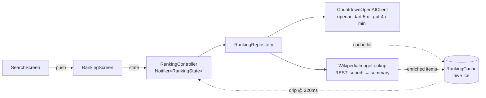

# Countdown

Ask the app any "top N" question. It uses GPT to compose a ranking, then
counts down from rank N to rank 1 with cinematic card reveals — gold,
silver, and bronze treatments on the podium, real images pulled from
Wikipedia for each item, a confetti burst that fires when #1 enters the
viewport.

> Labhouse Flutter Technical Test — **Option B**. iOS, **7h 30min** total
> across the dev session. See the **[Decisions & tradeoffs](#decisions--tradeoffs)**
> section below for the engineering substance.

---

## Quickstart

```bash
# 1. Pin Flutter via FVM (project uses 3.44.0)
fvm install                                    # reads .fvmrc

# 2. Get dependencies + run code generation
fvm flutter pub get
fvm dart run build_runner build

# 3. CocoaPods + iOS engine artifacts (one-time)
fvm flutter precache --ios
cd ios && pod install && cd ..

# 4. Run on iOS simulator with your OpenAI key
fvm flutter run --dart-define=OPENAI_API_KEY=sk-...
# or via the Makefile:
make run OPENAI_API_KEY=sk-...
```

The API key is read at compile time via `--dart-define`. The constant
lives in [`lib/core/env.dart`](./lib/core/env.dart) with a `// FIND-ME:
OPENAI_API_KEY` marker per the brief.

Without FVM, point Flutter at the SDK manually — the project targets
Flutter 3.44.0 / Dart 3.12+.

---

## What it does

1. **Search** — type a question or tap one of six example chips
   ("Top 10 ramen in Tokyo", "Best entrepreneurship books", …). The
   placeholder cycles every 3s.
2. **Reveal** — push to the Ranking screen. While GPT thinks, ten
   shimmering skeletons fill the list. Items stream in **rank N → rank 1**
   so the user scrolls down to discover the winner.
3. **Cards** — each item picks its own shape based on `kind`:
   `place` shows a Lucide MapPin + address, `book` shows "by author · year",
   `person` shows an italic tagline in a circular avatar, `generic`
   shows a clean fallback. Top-3 get gold / silver / bronze gradient
   rings, outer glows, and a Fraunces serif numeral with the tier color
   shader-masked into the digit.
4. **#1 reveal** — when rank 1 scrolls into the viewport, the dramatic
   700ms reveal fires, two upward gold confetti emitters explode from
   the card's bottom corners, the screen background warms with a subtle
   gold tint, and a medium haptic punctuates it.
5. **Images** — Wikipedia's REST API resolves each item's title
   ("Hereditary" → "Hereditary (film)") and pulls the page's 300px
   thumbnail. Items without a Wikipedia match fall back to a kind-icon
   placeholder (deliberate, not broken).
6. **Share** — both the app-bar share icon and the Done-bar Share pill
   capture the card stack and hand it to the iOS share sheet.

---

## Architecture

Feature-first Clean Architecture; sealed-union state machine.



| Layer | Owns |
|---|---|
| `core/` | env + theme tokens (color / type / spacing / radii / motion / tier styles) + `AppError` union + `Result<T>` |
| `features/ranking/domain/` | freezed sealed `RankItem` (place / book / person / generic), `Ranking`, `RankingState` union |
| `features/ranking/data/` | OpenAI client, Wikipedia enricher, Hive cache, repository, prompt builder |
| `features/ranking/presentation/` | `RankingScreen` + widgets, Riverpod providers, the visibility-triggered `RankOneReveal` |
| `features/search/` | `SearchScreen` (the app's home), input + rotating hint + chips |
| `features/share/` | `ShareService` — capture + iOS share sheet |

Async returns a `Stream<RankingState>` or a `Result<T, AppError>`; nothing
throws across layer boundaries.

---

## Stack

- **Flutter** 3.44.0 (pinned via FVM)
- **State**: `flutter_riverpod` 3.x — manual `Provider` / `Notifier` (no
  codegen; the riverpod generator pinned analyzer 7-9, which conflicts
  with `json_serializable` 6.14 which needs analyzer 10+)
- **Models**: `freezed` 3.x + `json_serializable` 6.x — sealed `RankItem`
  union discriminated by `kind`
- **AI**: `openai_dart` ^5.0.0 against **`gpt-4o-mini`** with
  `response_format: json_schema`. Image URLs come from Wikipedia, NOT
  from the model — see Decisions below.
- **HTTP**: `dio` ^5.9.2 + `dio_smart_retry` + `pretty_dio_logger`
- **Image enrichment**: Wikipedia REST API — `/w/rest.php/v1/search/page`
  resolves the page title, then `/api/rest_v1/page/summary/{title}` for
  the 300px thumbnail. Sequential calls (Wikipedia rate-limits parallel
  bursts even with a polite User-Agent).
- **Local cache**: `hive_ce` 2.x — invisible query → ranking cache, box
  `ranking_cache_v3`, LRU 50, no TTL.
- **Images**: `cached_network_image` with kind-specific Lucide fallback
- **Animation**: `flutter_animate`, `confetti`, custom `RevealAnimator`
  and `RankOneReveal` + `visibility_detector` (#1 reveal fires on
  viewport entry, not on stream arrival)
- **Maps**: `flutter_map` + OpenStreetMap (place cards, no API key)
- **Share**: `screenshot` + `share_plus`
- **Typography**: `google_fonts` — Fraunces (display serif numerals) +
  Inter (UI)
- **Icons**: `lucide_icons_flutter`
- **Lints**: `very_good_analysis` — clean
- **Tests**: `flutter_test`, `mocktail`, `alchemist`

---

## Decisions & tradeoffs

### "Let the LLM provide image URLs" — abandoned

The first cut asked the OpenAI response to include `imageUrl` for each
item. Three models were tried:

| Model | Result |
|---|---|
| `gpt-4o-mini` (no search) | Returned `null` for every URL — model played it safe per prompt's "be confident or null" guidance. |
| `gpt-4o-mini-search-preview` + `webSearchOptions` | **Hallucinated**. Every URL began with `upload.wikimedia.org/wikipedia/commons/4/4e/` — the same MD5 prefix for every item. Wikipedia paths are derived from each file's hash; reusing one prefix is impossible. All 404. |
| `gpt-4o-search-preview` (full size) + `webSearchOptions(searchContextSize: 'medium')` | **Also hallucinated**, but with different costumes. URLs looked like real travel-blog WordPress uploads (`stokedfortravel.com/wp-content/uploads/2024/02/<slug>-surfing.jpg`). Plausible, all 404. ~$0.05/query and ~20s latency for the privilege. |

The model knows the *shape* of plausible URLs and synthesizes them. Even
with web search and explicit "do not invent URLs, only emit ones from
search results" prompting, it confabulates.

**Resolution**: drop the LLM image-URL responsibility entirely. Use a
post-hoc Wikipedia REST enricher. Free, no auth, ~85-95% coverage for
typical ranking content. The kind-icon fallback for misses reads as a
deliberate "no image," not a broken URL. Net cost: ~$0.001/query
(gpt-4o-mini base) and ~7s total reveal latency.

### Wikipedia REST: search → summary, sequential

Two-step. The `/page/summary/{title}` endpoint alone gets confused on
ambiguous titles (e.g. "Hereditary" returns the heredity Wikipedia
article instead of the film). REST `/search/page?q=...&limit=1`
resolves the actual page title first, then `summary` returns the
thumbnail.

Wikipedia's MediaWiki API (`prop=pageimages`) was tried first as a
single call. It returned empty thumbnail data for most pages even
when a representative image exists — likely a `piprop` quirk specific
to that endpoint.

Calls are **sequential**. Parallel batches of 2 still tripped 429s
because `dio_smart_retry`'s retries stacked — multiple in-flight 429'd
requests all retried at the same backoff moment, re-hammering the
limit. Sequential adds ~2s but ~doubles the hit rate.

### Riverpod codegen — dropped

`riverpod_annotation` / `riverpod_generator` / `riverpod_lint` / `custom_lint`
all pin to `analyzer 7-9`, while `json_serializable 6.14` needs
`analyzer 10+`. Picking codegen meant downgrading models / freezed.
Picking the modern stack meant manual providers. The latter cost ~5
lines per provider and unblocked everything else; took the latter.

### Sealed union over inheritance

`RankItem.place / .book / .person / .generic` are freezed union
variants with a discriminator `kind` matching the JSON schema. Both
the parser and the rendering switch exhaust the union; adding a new
kind is an analyzer error in every dispatch site (good).

### Cache as plumbing, not a feature

The brief allows for invisible caching. I store rankings (enriched
imageUrls and all) in a Hive box keyed by normalized query. Re-asking
the same question replays instantly with the same drip cadence —
the reveal still feels alive. No user-visible "history" UI.

### iOS-only

Per the brief's "iOS *or* Android, no need to include other platforms."
Skipping Android cuts Cocoapods/Xcode-specific surface and lets the
visual work absorb the time saved.

---

## Project structure

```
lib/
├── main.dart                              # ProviderScope + portrait lock
├── app.dart                               # MaterialApp + theme + home: SearchScreen
├── core/
│   ├── env.dart                           # OPENAI_API_KEY via --dart-define
│   ├── errors.dart                        # sealed AppError union
│   ├── result.dart                        # Result<T> w/ exhaustive .when
│   └── theme/                             # color / type / spacing / radii / motion / tier styles
├── features/
│   ├── ranking/
│   │   ├── data/
│   │   │   ├── ranking_client.dart        # interface (test seam)
│   │   │   ├── openai_client.dart         # gpt-4o-mini wrapper
│   │   │   ├── wikipedia_image_lookup.dart# sequential REST search → summary
│   │   │   ├── ranking_cache.dart         # hive_ce, box ranking_cache_v3
│   │   │   ├── ranking_repository.dart    # cache-first → OpenAI → enrich → drip
│   │   │   └── prompt_builder.dart        # system prompt + JSON schema
│   │   ├── domain/                        # freezed: RankItem, Ranking, RankingState
│   │   └── presentation/
│   │       ├── ranking_screen.dart
│   │       ├── ranking_controller.dart    # Notifier<RankingState> + providers
│   │       └── widgets/                   # RankCard, RankOneReveal, ConfettiBurst, …
│   ├── search/
│   │   └── search_screen.dart             # app's home
│   └── share/
│       └── share_service.dart             # screenshot + share_plus
└── routing/                               # (reserved for go_router if scope grows)
test/features/ranking/                     # parser + repository state-machine tests
design/                                    # HTML mockup + tokens.css + 7 screenshot pngs
ios/Runner/                                # Info.plist (portrait, dark UI, permissions)
.fvmrc                                     # Flutter 3.44.0 pin
analysis_options.yaml                      # very_good_analysis
Makefile                                   # run / test / gen / pods / analyze / format
```

---

## Tests

```bash
make test    # or: fvm flutter test
```

- `rank_item_parser_test.dart` — happy + missing-discriminator + unknown-kind
- `ranking_repository_test.dart` — cache-miss / cache-hit / client-error /
  empty-query, all asserting the `RankingState` transition sequence
- `widget_test.dart` — `CountdownApp boots into the Search screen` smoke

`flutter analyze` runs clean under `very_good_analysis`.

---

## Performance — what I'd fix next

### Rebuilds

- The ranking screen watches the whole controller, so every streaming tick rebuilds the world. Narrow it with `ref.watch(provider.select((s) => s.runtimeType))` and pull the items read into a child `Consumer`.
- The card list is a plain `ListView` with all ten children up front. Switch to `ListView.builder` and collapse `_buildSlots` into the item builder.
- A few `item.when(...)` calls in `ranking_screen.dart` and `rank_card.dart` still allocate four closures each. Replace with sealed `switch` patterns. Same audit for `share_composition.dart`.

### Paint

- Three `BackdropFilter(sigma 18)`s rasterize on every frame. Drop sigma to 12 and wrap the scrollable body in a `RepaintBoundary` so the snapshot is reused while the list isn't dirty.
- `RevealAnimator` runs an `ImageFiltered` Gaussian blur on every card for the reveal. Skip the blur stage for ranks 4-10 (their 280ms window can't show it anyway); keep it for top-3.
- Wrap the `child` passed into `AnimatedBuilder` in `reveal_animator.dart` and `rank_one_reveal.dart` with a `RepaintBoundary`.

### Allocations

- `AppTypography.X` are `static TextStyle get`s that rebuild via `GoogleFonts.X(...)` on every access. Change to `static final TextStyle X = ...` so each style is built once.
- Pre-compute the `.copyWith(color: ...)` variants used across the ranking screen, search screen, rank card, and detail screen as named statics on `AppTypography`.
- `SearchScreen._hintQueries` is a getter that runs `_examples.map(...).toList()` on every build of the rotating hint. Make it `static final`.

---

## Stretch / future

- Voice input (`speech_to_text` is already in `pubspec.yaml`; mic
  affordance is in the Search screen, disabled)
- Dedicated 9:16 share composition (per `IDEA.md §3.5`) — current share
  captures the visible card stack as a quick MVP
- Hero transition into a Detail screen on card tap
- Illustrated error states for each `AppError` variant
- Golden tests for the four card kinds + the gold #1 tier
- Auto-scroll to #1 when `done` lands

---

## Submission deliverables

| Item | Value |
|---|---|
| Repository | https://github.com/deam91/countdown (public) |
| Compile target | **iOS** (Flutter 3.44.0 via FVM — see [Quickstart](#quickstart)) |
| Time spent | **7h 30min** |
| Screen recording | Add `demo.mp4` to the repo root, or link a hosted video in the submission email |

---

## License

Unlicensed — submission artifact for the Labhouse technical test.
